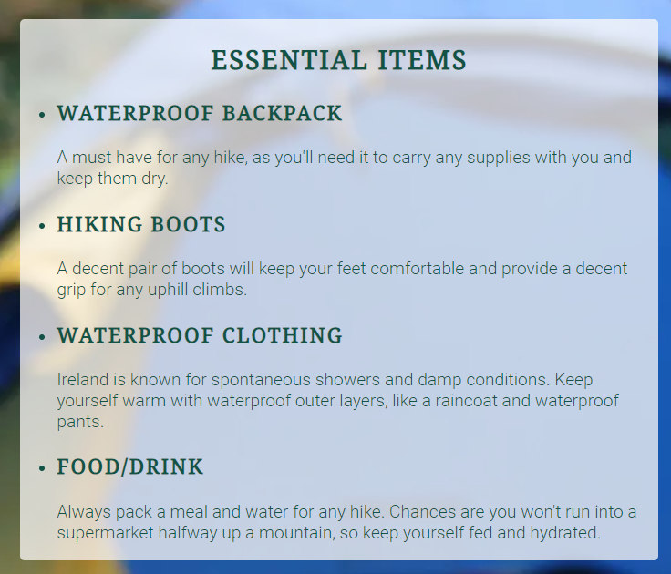

# Irish Mountains

Irish Mountains is a site for beginner hikers that will provide the information they need to get started hiking in Ireland. Irish Mountains provides resources to users such as lists of hiking equipment they will need, hiking locations ranging in difficulty, as well as a newsletter users can sign up for to keep up to date on new locations and info. This site will be targeted at hiking beginners, but will also be useful for outdoors oriented tourists who wish to see some of Irelands natural beauty. The live site can be visited [here](https://tmcenteggart.github.io/irish-mountains/index.html)

## Features

### Site Wide
* Navigation Menu
    * Contains links to the Home, Locations and Newsletter pages for quick site navigation on all devices.
    * Link to the users current page has a different color so the user knows what page they are currently viewing.

* Footer
   * This will contain icon links to social media websites. These websites will open in a new tab and be accessable to screen reader users by aria labels.
   * This will allow users to follow the Irish Mountains community on social media that may contain more up to date information than the site.

* Unique Landing Page Image
   * Each page will have a unique landing image.
   * The landing images show the user some of the landscapes that hiking has to offer.
   * Each landing image will be animated to catch the users attention.
   * The Newsletter landing image instills a sense of community in the user appropriate to the goal of the page.

#### Home Page Landing Image

#### Newsletter Page Landing Image

### Home Page

* Welcome Section
   * This section welcomes the user to the site, details the sites purpose and contains the essential items lists for hiking preparation.
   * Includes links to other pages of the site to encourage user interaction.
  

* Essentials Sections
   * Briefs the user on why hiking specific gear is needed.
   * This will include a link to Amazon for user convinience.

#### Essentials Section

#### Link to Amazon

* Items Lists
   * A pair of lists containing "Essential" hiking gear and "Optional" hiking gear respectively.
   * These lists will allow the user to determine what gear they need for their hike as well as acting as a checklist for the user while preparing for a hike.
   * When viewed on a small sized device, these lists will display in a column for increased responsiveness.

#### Essentials Checklist

#### Optional List

#### Standard List View

#### Column List View

* What Now Section
   * Simply acts as a signpost guiding users to the location page upon finishing the essentials guide.
   * Contains a link to the locations page.

#### Locations Link

### Locations Page

* Locations
   * The locations page is designed to provide the user with Irish Mountains top 3 hiking trails to experience. Each trail section will contain the name, location,  image of the trail, trail length, trail difficulty and a brief description of the trail.
   * The 3 trails are structured in ascending order of difficulty, starting from easy. This allows users new to hiking quick access to the easy trail, while giving the page a natural progression in trail size and difficulty. 

* Locations Intro
   * A brief introduction to the locations page.
   * Outlines to the user that the trails are listed in ascending order of difficulty.

### Newsletter Page

 * Newsletter
   * The newsletter page is designed for users to sign up for the Irish Mountains newsletter to stay updated on new info and trails.
   * This page contains a form element wherein users fill ot their first name, last name and email address. Completion of the form brings the user to a signup successful confirmation page.
   * The input fields for the form will have the required property, to ensure form submissions are functional.
 
 * Newsletter Form
   * This form will allow users to sign up for an optional newsletter using their name and email address.
   * This will encourage users to join the Irish Mountains community and keep them informed on future updates.
 
 
 
 ### Successful Sign-up Page
 
 
 * Successful Sign-up Page
   * This page will appear when a user has successfully completed the newsletter form.
   * This page will contain the same header and footer as all other site pages, allowing the user to return to any point of the site using the nav bar.
 
### Existing Features

* Hiking supplies guide with external link to Amazon
* Hiking locations list arranged by trail difficulty 
* Responsive design on all site pages
* Newsletter form with success page upon completion

### Features To Be Implemented

* A map to each trail location will be implemented to the locations page using Google Maps for user convenience.
* Automated email generation confirming a users newsletter subscription.
* Group event meeting and planning page for Irish Mountain community members.

## Technologies

* HTML
   * HTML was used as the main language for the sites structure,
* CSS
   * The website was styled using CSS a style sheet.
* GitHub
   * Used to store the repository for the site.
* GitPod
   * Used as the workstation for coding the HTML and CSS stylesheet as well as uploading image files to the site.
* GitPages
   * Used to deploy the finished site.

## Testing

### Responsiveness

Each page of the site was tested for responsiveness on screen sizes of 320px upwards using Chrome developer tools.

How it was tested:

1. Open browser and go to [Irish Mountains](https://tmcenteggart.github.io/irish-mountains/)
2. Open the developer tools by right clicking anywhere and selecting "inspect"
3. Set the dimensions to "Responsive" and set width to 320px
4. Set zoom to 50%
5. Slowly drag the responsive window to max width, checking for deviations in site structure
6. If a deviation occurs, navigate to a different page of the site to check if the deviation persists

Expected: 

Website responsive on all screen sizes from 320px upwards. No pixelated or stretched images, no horizontal scroll and no overlapping of site contents.

Actual:

Website was responsive as expected, however when viewing at 320px width an overlap of the navigation menu and hero image occurred. This issue disapeared when refreshing the page and re-booting developer tools.

## Accessibility

Accessibility for the site was tested using [Wave Accessibility](https://wave.webaim.org/) followed by manual testing using a keyboard only.

Wave did not detect any errors when tested throughout the website. Manual testing was successful, as I could navigate all facets of the site using a keyboard alone.

#### Home Page Wave Results

#### Locations Page Wave Results

#### Newsletter Page Wave Results

#### Signup Page Wave Results

 
 
 
 
 

 
 

  

